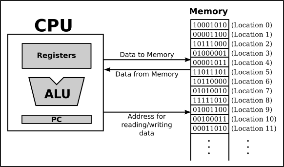
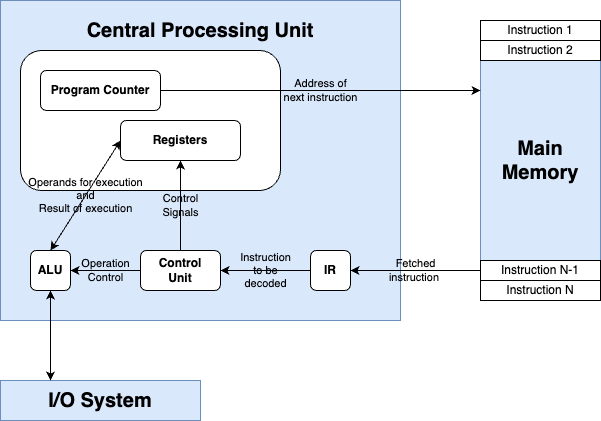
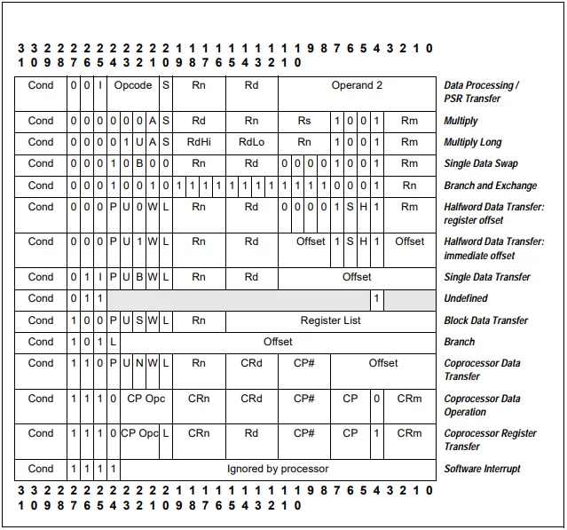
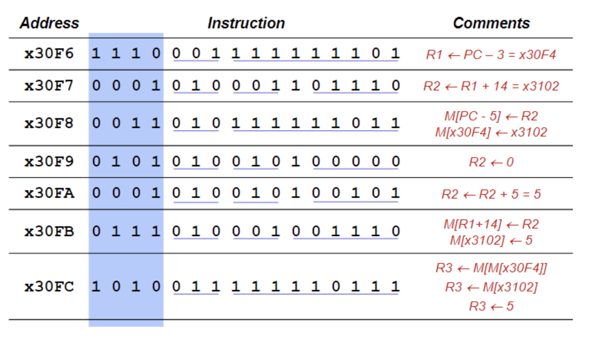
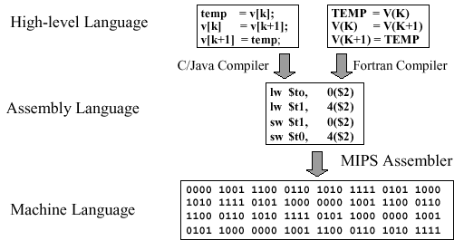
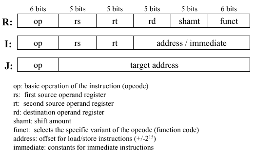
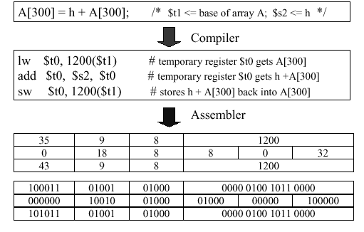
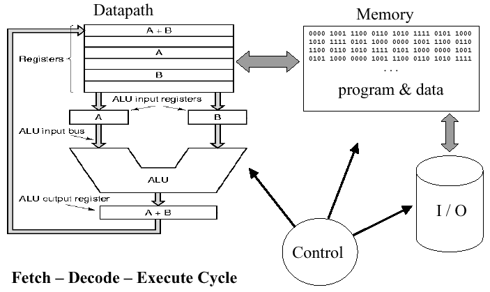
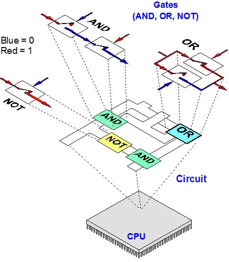
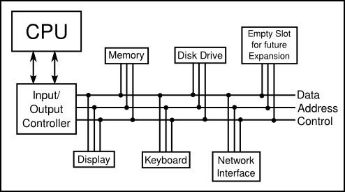

# Ch 1. Overview: The Mental Landscape

# Section 1. The Fetch and Execute Cycle: Machine Language

### 컴퓨터란?

- 다양한 구성 요소로 이루어진 시스템
- 하지만 결국 핵심은 실제로 연산을 수행하는 “CPU” 이다!
    - CPU의 역할은 프로그램을 실행하는 것

### 프로그램이란?

- 컴퓨터가 기계적으로 따라야 하는 지침 목록
- 다른 언어로 작성된 프로그램은 기계어로 변환되어야만 실행 가능

## CPU의 동작 방식

- 프로그램을 실행할 때, 해당 프로그램은 주 메모리 또는 RAM에 저장된다
    - 메모리는 프로그램 외에도 다양한 데이터가 저장된다
    - 메모리는 여러 위치의 연속적인 배열로 구성되며, 이는 주소라고 불린다
- CPU가 특정 위치의 프로그램 명령을 수행해야할때 해당 정보의 주소를 통해 메모리에 접근한다

### 순서로 표현하면..

1. CPU는 주 메모리에 기계어 명령의 연속으로 저장된 프로그램을 실행한다
2. 다음 명령을 가지고 오거나 반복 수행한다.

⇒ 결국 CPU의 작동 방식은 크게 이 실행 사이클을 벗어나지 않는다.

## CPU의 구성 요소

### 1. ALU (Arithmetic Logic Unit)

- 덧셈, 뺄셈 같은 연산을 수행하는 프로세서의 일부

### 2. Registers

- 단일 숫자를 저장할 수 있는 작은 메모리 장치
- 중간에 연산을 저장하는데 사용된다

### 3. PC (Program Counter)

- 프로그램의 현재 코드 위치라고 이해하면 된다
- CPU가 실행해야 하는 다음 명령어의 메모리 주소를 저장 ⇒ 프로그램 실행 위치를 추적하기 위함

### 추가적으로, 요즘은 CPU 안에 L1, L2, L3 등 캐시메모리를 넣어놓는다.

- 보통, 클럭단위로 동작을 한다.

### 내부에서 도는 것과 I/O System 에서 들어오는 외부는 차이가 많이난다.

- CPU에서 도는 것과 I/O 외부에서 들어오는 것과 속도 차이가 많이 나기 때문이다.

### Main Memory 도 CPU 가 도는 것과 비교하면 느리긴하다.

- 물론 외부보단 빠르다.
- 그것을 극복하기 위해서 나온 것이 L1, L2, L3 캐시이다.

## 결국 기본 프로그램 실행 과정은 아래와 같다.

1. 명령 가져오기

2. 명령 실행

3. PC 업데이트

4. 반복

## 기계어

- 기계어는 이렇게 생겼대

- 해석을 하자면 R1 으로 PC 를 옮기고 3을 빼라 이런 말이래.

## CPU 와 기계어의 작동

### 1. 명령어 저장

초기 언어는 다르지만 결국 어셈블리 언어로 변환이 되어서 컴퓨터가 이해할 수 있도록 변환된다

### 2. 명령어 로드

어떤 것들은 주소값이 저장되고 어떤 것은 그냥 그대로의 값이 저장이 된다.

### 3. 명령어 해석

### 4. 명령 실행

## CPU는 깊게 들어가면 결국 레지스터 밖에 없다.

이 레지스터들을 이용해서 어떤 시스템을 만들게 되는 것.

# Section 2. **Asynchronous Events: Polling Loops and Interrupts**

### 컴퓨터에는 CPU 뿐만 아니라, 굉장히 많은 장치가 연결된다

- SSD, 키보드, 마우스, 오디오 등등
- 심지어는 더 연결할 수도 있다.

### CPU는 이러한 모든 장치들을 제어해야한다

- 각 장치 드라이버들이 이를 도와준다

### 데이터 버스로 연결되어 CPU는 각 장치를 제어하는 명령을 보내거나 데이터를 받곤 한다

- 키보드, 마우스, 네트워크 인터페이스 등은 CPU가 처리해야할 입력들을 생성한다.

## 그런데, CPU는 어떻게 각 장치에서 데이터가 입력되고 있는지 알 수 있을까?

### 1. Polling

- CPU가 반복적으로 데이터가 있는지 확인하는 방법
- 간단하지만 비효율적임
- 입력을 기다리기 위해 너무 많은 시간을 낭비한다

### 2. Interrupts

- 각 장치는 CPU에게 신호를 보낸다
- CPU는 해당 신호를 받으면, 현재 수행 중인 작업의 상태를 나중에 복원할 수 있도록 저장해놓고 해당 신호를 처리한다

위와 같은 인터럽트 처리, 사용자 및 하드웨어 장치와의 통신 처리, 실행할 쓰레드를 제어하는 소프트웨어를 운영체제라고 한다.

# Section 3. Java Virtual Machine

### 컴파일러란?

- CPU는 기계어만 읽을 수 있는데, 대부분의 프로그램은 Java, Python 등 프로그래밍 언어로 작성된다.
- 이를 기계어로 변환시켜주는 프로그램이다
- 프로그램을 한 번에 모두 번역한다

### 인터프리터란?

- 명령어를 한 줄씩 번역한다
- 일종의 CPU처럼 작동한다
    - 명령어를 가져오고 해당 명령어를 수행하기위해 필요한 작업을 결정하고 적절한 기계어 명령어를 수행한다.

### 컴파일러 vs 인터프리터

번역가와 통역가의 차이라고 생각하면 된다.

한 권의 책을 통째로 번역하는지, 즉시 바로 통역을 해주는지

## Java는 컴파일러와 인터프리터를 결합하여 사용된다

# Section 4. Fundamental Building Blocks of Programs

변수, 타입, 제어문에 대한 설명들

# Section 5. Objects and Object-Oriented Programming

### 한번에 복잡한 프로그램을 만드는 것은 불가능한 일이다.

그래서 결국 여러 소프트웨어 공학 방법론이 등장하게 된다.

### Top - Down Programming

1970년대부터 80년때까지 주로 쓰인 방법론이다.

큰 문제를 해결하기 위해 문제를 여러 부분으로 나누고 개별적으로 작업한다.

### 단점

1. 수행한 작업을 재사용하기 어렵게 만든다
2. 데이터에 대한 고려를 충분히 하지 못한다

## 그래서 OOP가 등장했다

- 데이터와 서브루틴을 이용해서 재사용하기 쉽도록 만든다
- 어떤 기기의 구체적인 작동 원리를 몰라도 사람이 사용 할 수 있는 것처럼 동작 원리를 숨긴다.
    - 이를 정보 은닉이라고 한다.

 

# Section 7. The Internet and Beyond

### 프로토콜이란?

- 통신을 어떻게 진행할 것인지에 대한 규칙이자 명세
- 두 컴퓨터가 통신하려면 동일한 프로토콜을 사용해야 한다

### 인터넷은 IP 프로토콜을 사용하고 TCP(전송 제어 프로토콜)로 IP를 통해 보낸 데이터가 완전하도록 보장한다.

- 이것이 TCP/IP 이다

### IP?

- 인터넷에 연결된 모든 컴퓨터는 고유한 IP 주소를 갖는다
- IP 주소는 패킷의 주소 지정에 사용된다